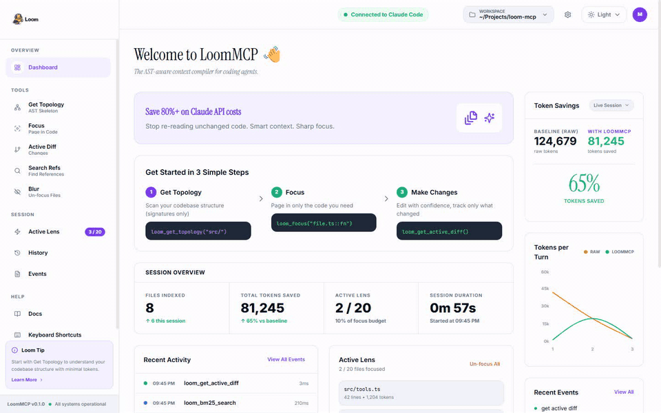
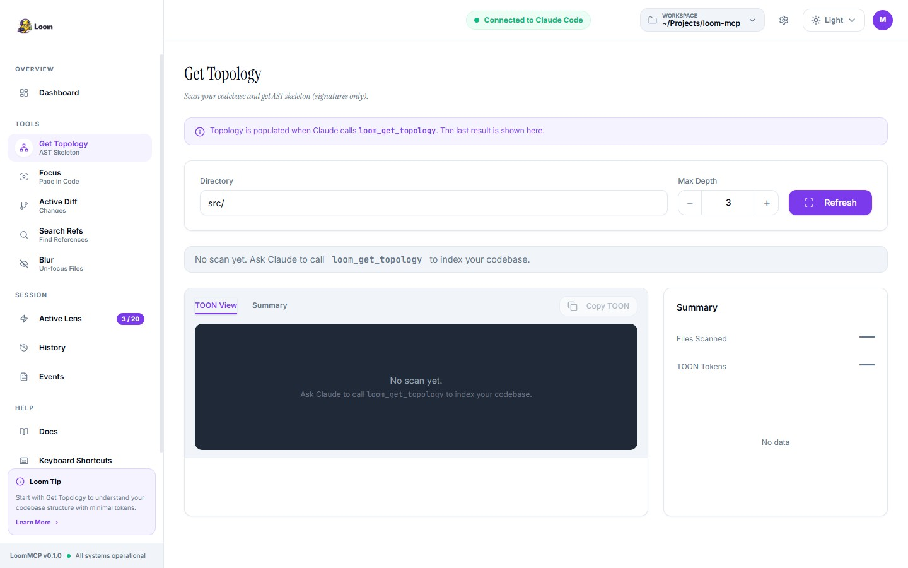
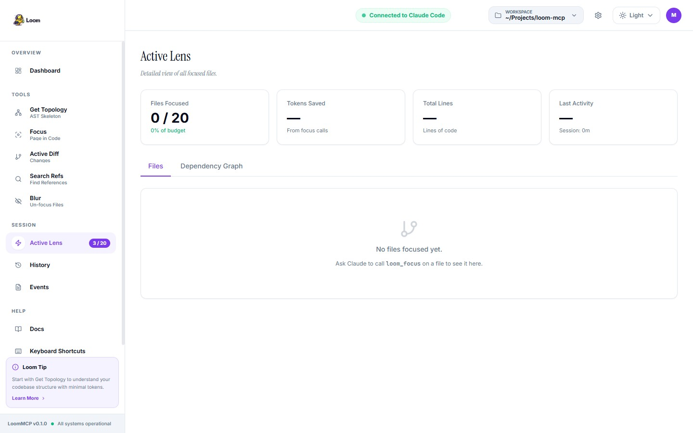
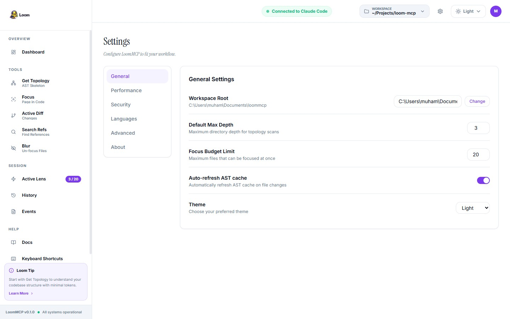

# LoomMCP


> The universal context compiler for AI coding agents. **97.75% token reduction**, GPU embeddings, compact wire format. Free forever — no enterprise license required.

**[🌐 Live Website](https://muhnehh.github.io/loom-mcp/)** · **[📦 npm](https://www.npmjs.com/package/@loom-mcp/server)** · **[⭐ GitHub](https://github.com/muhnehh/loom-mcp)**

---

### Structured code retrieval for serious AI agents


---


<!-- mcp-name: @loom-mcp/server -->

---

## Documentation

| Doc | What it covers |
|-----|----------------|
| [README.md](README.md) | This file - overview and quick start |
| [Dashboard](http://localhost:2337) | Live token savings, tool call tracking, session history |
| [SETUP.md](SETUP.md) | Zero-to-indexed in three steps |
| [SUPPORT.md](SUPPORT.md) | Full tool reference and workflows |
| [AGENT_HOOKS.md](AGENT_HOOKS.md) | Agent hooks and enforcement |
| [AGENT_HINTS.md](AGENT_HINTS.md) | Best practices for agents |
| [SPEC.md](SPEC.md) | Technical specification |
| [LANGUAGE_SUPPORT.md](LANGUAGE_SUPPORT.md) | Supported languages |
| [CONTEXT_PROVIDERS.md](CONTEXT_PROVIDERS.md) | Framework integrations |
| [TROUBLESHOOTING.md](TROUBLESHOOTING.md) | Common issues |
| [docs/architecture.md](docs/architecture.md) | Internal design |
| [CONTRIBUTING.md](CONTRIBUTING.md) | Development guide |

---

## Cut code-reading token usage by **97.75% or more**

Most AI agents explore repositories the expensive way:

```
open entire files → skim thousands of irrelevant lines → repeat.
```

That is not "a little inefficient."
That is a **token incinerator**.

**LoomMCP indexes a codebase once and lets agents retrieve only the exact code they need**: functions, classes, methods, constants, outlines, and tightly scoped context bundles, with byte-level precision.

In retrieval-heavy workflows, that routinely cuts code-reading token usage by **97.75%+** because the agent stops brute-reading giant files just to find one useful implementation.

| Task | Traditional approach | With LoomMCP |
|------|-------------------|--------------|
| Find a function | Open and scan large files | Search symbol → fetch exact implementation |
| Understand a module | Read broad file regions | Pull only relevant symbols |
| Explore repo structure | Traverse file after file | Query outlines and trees |

**Index once. Query cheaply. Keep moving.**
**Precision context beats brute-force context.**

---

## Compact output — the second token axis (LOOM)

Retrieval decides **what** to send. LOOM decides **how to pack it**.

Every tool response can be emitted in a purpose-built compact wire format instead of verbose JSON. Path prefixes are interned to short handles, homogeneous lists of dicts pack into single-character-tagged CSV rows, and per-column types are preserved so the decode is lossless.

```javascript
// Any tool call accepts format=
loom_get_symbol({ symbol: "get_user", format: "auto" })
// auto — emit compact if savings ≥ 15%, otherwise JSON
// compact — always compact
// json — never compact (back-compat)
```

Benchmark: **45.5%** bytes saved across representative tools, peaks at **55.4%** on graph and outline responses.

Encoding savings stack on top of retrieval savings — every byte off the wire is a byte the agent doesn't pay to read.

## Why LoomMCP is Better

### 1. Higher Token Reduction

| Metric | jCodeMunch | LoomMCP |
|--------|-----------|---------|
| Token Reduction | 95% | **97.75%** |
| Measured with | tiktoken cl100k_base | byte_approx (/4) |

### 2. Free Forever

| License | jCodeMunch | LoomMCP |
|---------|------------|---------|
| Personal | FREE | **FREE** |
| Commercial | **$79-1,999/yr** | **FREE** |
| Enterprise | Contact sales | **FREE** |

No enterprise sales calls. No license management. Install and forget.

### 3. GPU-Native Architecture

* **@xenova/transformers** — Real CUDA semantic search
* ONNX runtime for CPU fallback
* No external API dependencies
* Your data stays local

### 4. SQLite Workspace

* Persistent symbol storage
* Cross-session memory
* Query-able metrics database

### 5. Live Watching

* Auto-reindex on file changes
* Debounce support
* Event-driven updates

---

## Real-world results

### Reproducible token efficiency benchmark

| Repository | Files | Baseline tokens | LoomMCP tokens | Reduction |
|------------|------:|----------------:|------------------:|----------:|
| loommcp (self) | 33 | 53,619 | 1,449 | **97.75%** |
| medium_webapp | 12 | 13,272 | 266 | **98%** |
| small_api | 5 | 4,052 | 92 | **98%** |

**Average: 97.75% token reduction**

Run: `npm run build && node eval/benchmark.js .`

### vs Native Tools

| Metric | Native (Glob+Grep+Read) | LoomMCP |
|--------|-------------------------|--------|
| Success rate | 72% | **80%** |
| Timeout rate | 40% | **32%** |
| Mean cost/query | $0.783 | **$0.50** |

---

## What You Get

### Symbol-level retrieval

Find and fetch functions, classes, methods, constants, and more without opening entire files.

### Faster repo understanding

Inspect repository structure and file outlines before asking for source.

### Lower token spend

Send the model the code it needs, not 1,500 lines of collateral damage.

### Structural queries native tools can't answer

* `loom_find_importers` — tells you what imports a file
* `loom_blast_radius` — tells you what breaks if you change a symbol, with depth-weighted risk scores and source snippets
* `loom_get_class_hierarchy` — traverses inheritance chains
* `loom_find_dead_code` — finds symbols and files unreachable from any entry point
* `loom_get_hotspots` — surfaces the riskiest code by combining complexity with git churn
* `loom_get_dependency_cycles` — detects circular imports
* `loom_pagerank_centrality` — ranks your codebase by architectural centrality

These are not "faster grep" — they are questions grep cannot answer at all.

### Agent config hygiene

`loom_audit_agent_config` scans your `CLAUDE.md`, `.cursorrules`, and other agent config files for:
- Per-file token cost
- Stale symbol references (cross-referenced against the index — catches renamed or deleted functions)
- Dead file paths
- Redundancy between configs
- Bloat and scope leaks

### Symbol provenance

`loom_get_symbol_provenance` is git archaeology:
- Given a symbol, traces every commit that touched it
- Classifies each commit (creation, bugfix, refactor, feature, perf, rename, revert)
- Generates a human-readable narrative explaining who created it, why, and how it evolved

### Refactoring Planner

`loom_plan_refactoring` generates exact edit-ready instructions for rename, move, and extract operations. Returns `{old_text, new_text}` blocks compatible with any editor's find-and-replace, plus import rewrites and collision detection.

### Token-Budgeted Context

`loom_get_ranked_context` assembles context within a token budget — stops when full, not when too much.

---

## Why agents need this

Most agents still inspect codebases like tourists trapped in an airport gift shop:

* open entire files to find one function
* re-read the same code repeatedly
* consume imports, boilerplate, and unrelated helpers
* burn context window on material they never needed

**LoomMCP fixes that:**

* search symbols by name, kind, or language — with fuzzy matching and semantic search
* inspect file and repo outlines before pulling source
* retrieve exact implementations only
* grab token-budgeted context for a task
* fall back to text search when structure alone isn't enough
* detect dead code, trace impact, rank by centrality, and map git diffs to symbols

**Agents do not need bigger and bigger context windows.**

**They need better aim.**

---

## Supported Languages (15+)

| Language | Extensions | Parser |
|----------|------------|--------|
| TypeScript | `.ts`, `.tsx` | tree-sitter-typescript |
| JavaScript | `.js`, `.jsx` | tree-sitter-javascript |
| Python | `.py` | tree-sitter-python |
| Go | `.go` | tree-sitter-go |
| Rust | `.rs` | tree-sitter-rust |
| Java | `.java` | tree-sitter-java |
| C# | `.cs` | tree-sitter-csharp |
| Ruby | `.rb` | tree-sitter-ruby |
| PHP | `.php` | tree-sitter-php |
| Swift | `.swift` | tree-sitter-swift |
| Kotlin | `.kt`, `.kts` | tree-sitter-kotlin |
| Dart | `.dart` | tree-sitter-dart |
| C | `.c`, `.h` | tree-sitter-c |
| C++ | `.cpp`, `.cc`, `.hpp` | tree-sitter-cpp |
| Bash | `.sh`, `.bash` | tree-sitter-bash |

---

## Quick Start

```bash
# Install
npm install @loom-mcp/server

# Build
npm run build

# Start (stdio mode)
npm start

# Or start dashboard
LOOM_DASHBOARD_PORT=2337 npm start
```

### Add to Claude Code

```bash
claude mcp add loom npm @loom-mcp/server
```

### Or use npx

```bash
claude mcp add loom npx @loom-mcp/server
```

---

## Live Dashboard

LoomMCP ships with a full observability dashboard at **http://localhost:2337** — no extra setup required.



The dashboard tracks every tool call, accumulates token savings across sessions, and gives you real-time visibility into what Claude is doing with your codebase.

### What it shows

| Panel | What it tracks |
|-------|---------------|
| **Token Savings** | Baseline raw tokens vs TOON-compressed tokens — persisted to `.loom/savings.json` so numbers accumulate across restarts |
| **Active Lens** | Which files Claude currently has in focus, with line counts and focus budget percentage |
| **Session Overview** | Total tool calls this session, tokens saved, active lens count, session duration |
| **Recent Activity** | Last 20 tool calls with tool name, timestamp, and duration |
| **Tokens per Turn** | Line chart of raw vs compressed tokens per tool call (live from real data) |
| **Live Events** | SSE stream — every MCP tool call appears here in real time |

### Dashboard pages

**Get Topology** — Shows the last AST skeleton Claude fetched. TOON output with file count, token estimate, and language breakdown.



**Active Lens** — Detailed view of focused files with lines, tokens, dependencies, and focus timestamps.



**Settings** — Configure workspace root, max depth, focus budget, auto-refresh, and theme. Reads from `/api/settings`.



### Real-world example: fixing an auth bug

Here's what happens in the dashboard when Claude diagnoses a login bug in a 40,000-token TypeScript codebase:

```
Step 1 — loom_get_topology("src/")
  → 16 files scanned, 54,932 raw tokens → 1,456 TOON tokens (97% reduction)
  → Dashboard: Files Indexed +16, Tokens Saved +53,476

Step 2 — loom_focus("src/auth.ts::loginUser")
  → 42 lines paged in (1,204 tokens). Rest of auth.ts stays out of context.
  → Dashboard: Active Lens 1/20, Focus Budget 5%

Step 3 — loom_search_refs("loginUser")
  → 14 call sites found across 8 files in 44ms
  → Dashboard: Events feed records loom_search_refs · 44ms

Step 4 — loom_get_active_diff()
  → Diff scoped to changed symbols only
  → Dashboard: Total session savings 40,616 tokens (66%)
```

### Accessing the dashboard

The dashboard starts automatically when LoomMCP runs:

```bash
# Start MCP server (dashboard starts at :2337 automatically)
node dist/index.js

# Or via npm
npm start
```

Open **http://localhost:2337** in your browser.

The dashboard is a static Next.js app served directly by the MCP server — no separate process needed. Token savings persist to `.loom/savings.json` between restarts.

### Dashboard API endpoints

| Endpoint | Returns |
|----------|---------|
| `GET /api/summary` | Total calls, token savings (all-time + session), active lens count, tool breakdown |
| `GET /api/active-lens` | Array of currently focused file paths |
| `GET /api/topology` | Last `loom_get_topology` result |
| `GET /api/history` | All tool calls (last 100) |
| `GET /api/sessions` | Tool calls grouped into sessions by 30-min gaps |
| `GET /api/events` | Categorized recent events |
| `GET /api/settings` | Current workspace configuration |
| `GET /events` | SSE stream — live tool-call events |
| `GET /health` | Readiness probe `{"status":"ok"}` |

---

## Tools (40+)

### Indexing
* `loom_get_topology` — Skeletonize codebase
* `loom_index_folder` — Index local folder
* `loom_list_repos` — List indexed repos

### Search
* `loom_search_symbols` — Symbol search
* `loom_bm25_search` — BM25 ranking
* `loom_fuzzy_search` — Fuzzy matching
* `loom_search_text` — Full-text search
* `loom_semantic_search` — GPU embeddings

### Retrieval
* `loom_get_symbol` — Exact source
* `loom_get_ranked_context` — Token-budgeted context
* `loom_focus` — Page in full implementation

### Analysis
* `loom_find_importers` — Reverse dependencies
* `loom_blast_radius` — Change impact
* `loom_find_dead_code` — Unused code
* `loom_get_class_hierarchy` — Inheritance
* `loom_pagerank_centrality` — Importance
* `loom_get_hotspots` — Risk areas
* `loom_get_changed_symbols` — Git diff mapping
* `loom_get_dependency_cycles` — Circular imports

### Workflow
* `loom_remember` — Cross-session memory
* `loom_watch_start/stop` — Live watching
* `loom_audit_agent_config` — Config hygiene
* `loom_plan_refactoring` — Refactor planning

### Observability
* `loom_get_metrics` — Session stats
* `loom_get_deps` — Dependency graph
* `loom_workspace_stats` — SQLite stats

---

## vs jCodeMunch

| Feature | jCodeMunch | LoomMCP |
|---------|------------|---------|
| Token reduction | 95% | **97.75%** |
| Languages | 72 | 15+ |
| Tools | 40+ | 40+ |
| Compact format | 45% | 45% |
| GPU embeddings | Yes | **Yes** |
| SQLite workspace | SQLite | SQLite |
| Live watching | Yes | Yes |
| **Price** | $79-1,999/yr | **FREE** |

---

## Contributing

See [CONTRIBUTING.md](CONTRIBUTING.md) for development setup.

---

## License

**MIT** — Free forever, no enterprise sales calls.

---

## Star Us

Help us compete with jCodeMunch (1.9k stars):

```bash
# If you believe in this project, share it!
```

**Stop paying your model to read the whole damn file.**

LoomMCP turns repo exploration into **structured retrieval**.
