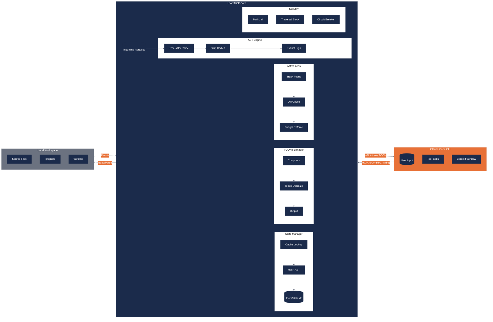
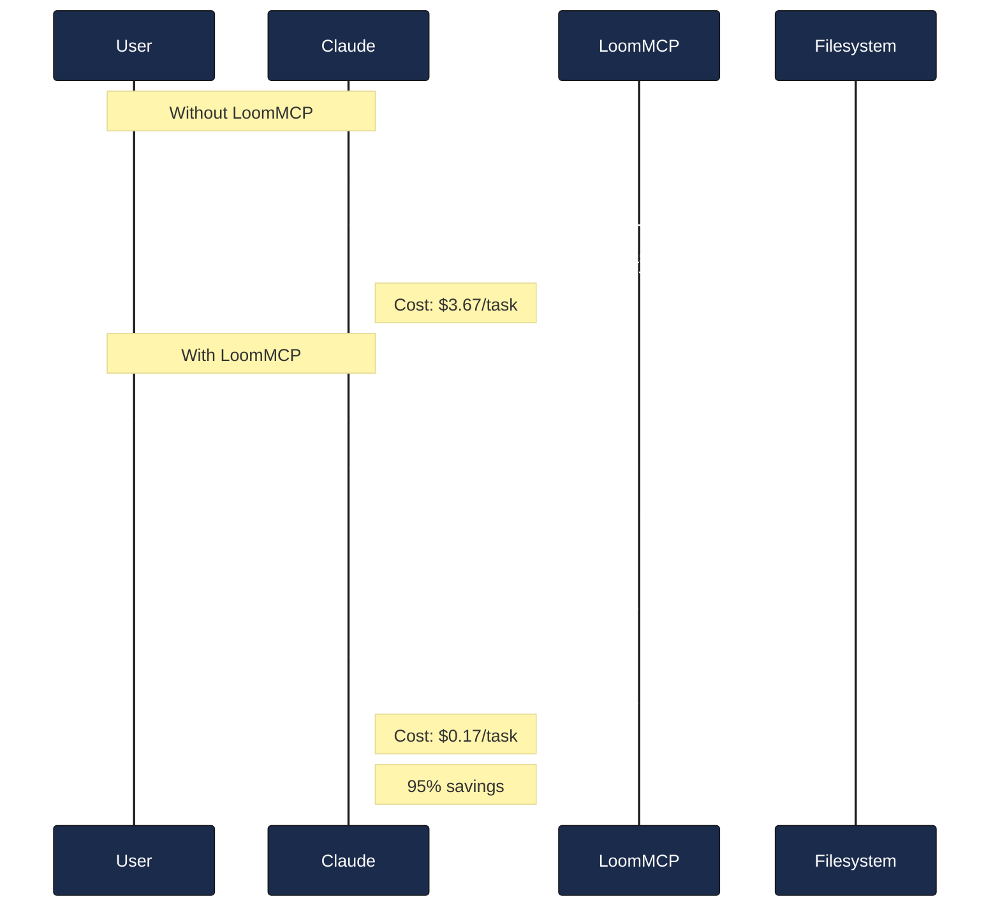
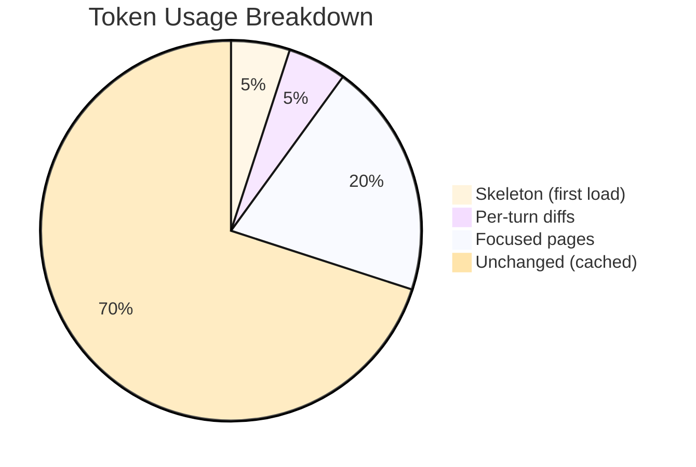
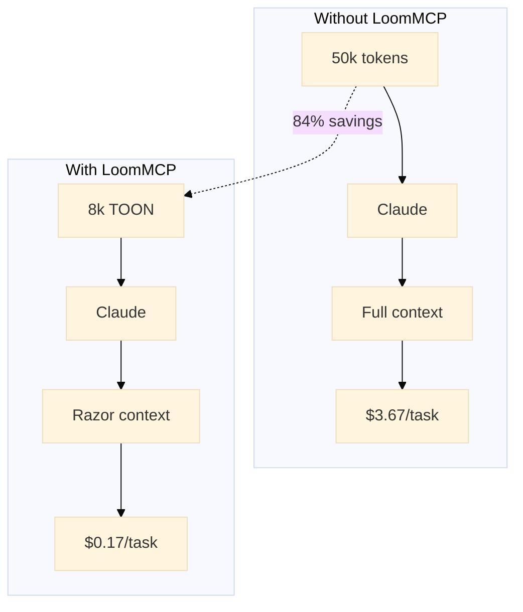

```mermaid
%%{init: {'theme':'base','themeVariables':{'primaryColor':'#1B2B4B','primaryTextColor':'#fff','primaryBorderColor':'#1B2B4B','lineColor':'#6B7280','secondaryColor':'#E87137','tertiaryColor':'#fff'}}}%%
flowchart LR
    subgraph CLAUDE["Claude Code CLI"]
        direction TB
        C1[("User Input")]
        C2[Tool Calls]
        C3[Context Window]
    end

    subgraph LOOM["LoomMCP Core"]
        direction LR
        A[("Incoming Request")]
        
        subgraph PARSE["AST Engine"]
            T1[Tree-sitter Parse]
            T2[Strip Bodies]
            T3[Extract Sigs]
        end
        
        subgraph CACHE["State Manager"]
            S1[Cache Lookup]
            S2[Hash AST]
            S3[(.loom/state.db)]
        end
        
        subgraph TOON["TOON Formatter"]
            F1[Compress]
            F2[Token Optimize]
            F3[Output]
        end
        
        subgraph LENS["Active Lens"]
            L1[Track Focus]
            L2[Diff Check]
            L3[Budget Enforce]
        end
        
        subgraph SEC["Security"]
            P1[Path Jail]
            P2[Traversal Block]
            P3[Circuit Breaker]
        end
        
        A --> T1 --> T2 --> T3
        S1 --> S2 --> S3
        F1 --> F2 --> F3
        L1 --> L2 --> L3
    end

    subgraph FS["Local Workspace"]
        direction TB
        W1[Source Files]
        W2[.gitignore]
        W3[Watcher]
    end

    CLAUDE --"MCP JSON-RPC (stdio)"--> LOOM
    LOOM --"~8k tokens TOON"--> CLAUDE
    LOOM --"Read/Parse"--> FS
    FS --"Events"--> LOOM

    style CLAUDE fill:#E87137,color:#fff
    style LOOM fill:#1B2B4B,color:#fff
    style FS fill:#6B7280,color:#fff
```

```mermaid
%%{init: {'theme':'base','themeVariables':{'primaryColor':'#1B2B4B','primaryTextColor':'#fff'}}}%%
sequenceDiagram
    participant User
    participant Claude
    participant LoomMCP as LoomMCP
    participant FS as Filesystem

    Note over User,Claude: Without LoomMCP
    User->>Claude: Fix auth bug
    Claude->>FS: cat src/**/*.ts (50k tokens)
    FS-->>Claude: Full codebase
    Note right of Claude: Cost: $3.67/task

    Note over User,Claude: With LoomMCP  
    User->>Claude: Fix auth bug
    Claude->>LoomMCP: loom_get_topology("src")
    LoomMCP->>FS: Parse AST
    FS-->>LoomMCP: Skeleton (4k tokens)
    LoomMCP-->>Claude: TOON skeleton
    
    Claude->>LoomMCP: loom_search_refs("loginUser")
    LoomMCP-->>Claude: 1 usage
    
    Note right of Claude: Cost: $0.17/task
    Note right of Claude: 95% savings
```

```mermaid
%%{init: {'theme':'base'}}%%
pie title Token Usage Breakdown
    "Skeleton (first load)" : 5
    "Per-turn diffs" : 5
    "Focused pages" : 20
    "Unchanged (cached)" : 70
```

```mermaid
%%{init: {'theme':'base'}}%%
graph TD
    subgraph BEFORE["Without LoomMCP"]
        B1[50k tokens] --> B2[Claude]
        B2 --> B3[Full context]
        B3 --> B4[$3.67/task]
    end
    
    subgraph AFTER["With LoomMCP"]
        A1[8k TOON] --> A2[Claude]
        A2 --> A3[Razor context]
        A3 --> A4[$0.17/task]
    end
    
    B1 -.->|84% savings| A1
```